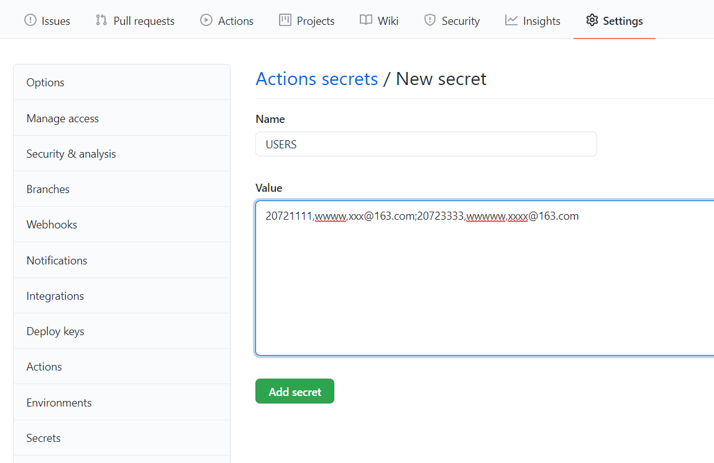

# 上海大学健康之路每日一报/每日两报自动打卡-邮箱提醒

程序为python脚本文件，修改配置文件相关信息，设置后台运行脚本，脚本会根据配置文件信息自动进行每日一报/每日两报。

支持github actions服务器。支持一键补报功能。

支持每日一报/每日两报。目前暂时同时进行每日一报和每日两报。

原作者仓库地址https://github.com/BlueFisher/SHU-selfreport，
本仓库加了每天报送的邮件提醒。

## 免责申明

本项目仅做免费的学术交流使用。

## 用法

### 0. ⭐Star⭐项目😉

如果你想获取最新的更新，记得右上角的`watch`

### 1. 使用 github actions（推荐）

1. fork 该仓库至你的仓库下
2. 定位到你的仓库的`Settings`的`Secrets`选项卡
3. 添加secret（New repository secret）

`NAME` 设置为 `USERS`

`VALUE` 设置为 `学号1,密码1,邮箱1;学号2,密码2,邮箱2` 的格式，注意逗号与分号的区分，学号密码之间用逗号，每两个学号之间用分号，必须是英文半角符号，如果只有一个学号密码则不需要加分号

4. 定位到你仓库下的 `Actions` 选项卡，点击 `Enable workflow`

5. 此时Actions 已经启动完成，每天上午和下午七点（UTC+8）各执行一次，每执行一次会在 `Actions` 选项卡下生成一个报告。

   如果需要对报送功能进行测试，可以点击 `run workflow` 按钮，立即进行一次运行。

   

## 依赖

- python3
- 依赖：
  - pyyaml
  - beautifulsoup4
  - requests

## 感谢

感谢各位 contributors 所做的贡献。

